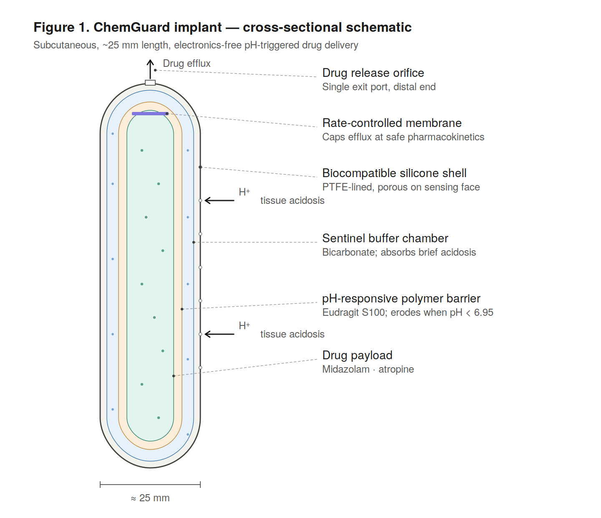
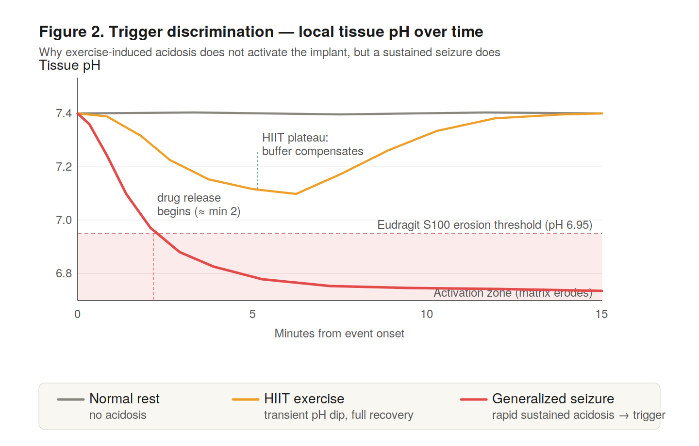

# CREST
Authors: Yasenovyi Varfolomii and Yelyzaveta Pavlova
**C**ontrolled **R**elease **E**mergency **S**eizure **T**herapy — an electronics-free, pH-triggered subcutaneous implant concept for autonomous seizure rescue.

[](https://doi.org/10.5281/zenodo.19976598)


> **No prototype. No animal data. No clinical claims.**
> This is a pre-prototype concept note filed on Zenodo to establish date of priority and invite technical critique.

---

## The problem

About 30% of people with epilepsy have drug-refractory disease. For this group, a generalised tonic-clonic seizure outside hospital — no caregiver, no rescue medication — can progress to status epilepticus in minutes.

Existing closed-loop devices (NeuroPace RNS, VNS) work, but cost $15–40k USD, require cranial surgery, and run on batteries that need periodic replacement. Nothing in that price range is available for most of the world.

*The author developed status epilepticus and was admitted to intensive care. This project is a direct response to the absence of an affordable autonomous rescue option.*

---

## The concept

A small subcutaneous capsule (~25 mm) that uses the lactic acidosis produced during a sustained seizure as a **purely mechanical chemical trigger** — no electronics, no battery, no specialist programming.

<p align="center">
  
</p>

### How it works

| Layer | Material | Function |
|---|---|---|
| Outer shell | Medical-grade silicone, microporous face | Lets H⁺ ions equilibrate with tissue |
| Sentinel buffer | Bicarbonate solution | Absorbs short-duration acidosis (exercise) |
| Polymer barrier | Eudragit S100 | Erodes when pH < 6.95 — after buffer is exhausted |
| Drug reservoir | Midazolam + atropine | Released through rate-controlled exit membrane |

### The trigger discrimination problem

A naive pH threshold would false-trigger on HIIT or competitive sport. The sentinel buffer solves this by acting as a **temporal integrator**: brief exercise-grade acidosis (10–15 min) is absorbed without reaching the polymer; sustained seizure-grade acidosis (30–60+ min) exhausts the buffer locally and triggers erosion.

<p align="center">
  
</p>

---

## What's known and what isn't

The concept is grounded in published physiology but the central link is unverified:

| Evidence | Source | Directness |
|---|---|---|
| Arterial pH 7.14 ± 0.06 post-seizure, normalises in 60 min | Orringer et al., NEJM 1977 | Direct human data (blood) |
| Brain ECF pH drop ~0.36 units, persists ≥45 min post-ictal | Siesjö et al., JCBFM 1985 | Animal data (brain ECF) |
| Blood-to-interstitial lag ~2–8 min | CGM glucose literature | Indirect analogy |
| **Subcutaneous pH during GTCS in humans** | **Not found in literature** | **This is the gap** |

The primary experimental question before any prototype work: *does subcutaneous tissue pH drop below 7.0 during a human GTCS, and for how long?*

---

## Open questions

- Subcutaneous pH kinetics during human GTCS (the critical unknown)
- Eudragit S100 erosion rate in subcutaneous conditions vs. GI conditions
- Midazolam stability in polymer matrix at 37°C over 12–24 months
- Foreign body response effect on pH equilibration and drug release
- Sentinel buffer sizing to set the exercise/seizure discrimination threshold

---

## Repository contents

```
crest-implant/
├── README.md
├── CITATION.cff
├── LICENSE
├── CREST_Concept_Note_v2.pdf     ← full concept paper with references
└── figures/
    ├── figure1_cross_section.svg  ← vector source
    ├── figure1_cross_section.png
    ├── figure2_timeline.svg
    └── figure2_timeline.png
```

---

## Cite this work

```bibtex
@misc{yasenovyi2026crest,
  author    = {Yasenovyi, Varfolomii},
  title     = {{CREST}: an electronics-free, pH-triggered subcutaneous implant
               for emergency seizure rescue},
  year      = {2026},
  publisher = {Zenodo},
  doi       = {10.5281/zenodo.19976598},
  url       = {https://doi.org/10.5281/zenodo.19976598}
}
```

---

## License

Text and figures: [CC BY 4.0](https://creativecommons.org/licenses/by/4.0/)  
Use freely, cite the Zenodo DOI.

---

## Feedback

Technical critique is the point of making this public. If you know polymer erosion kinetics, seizure physiology, or subcutaneous drug delivery — open an issue or email via GitHub profile.
